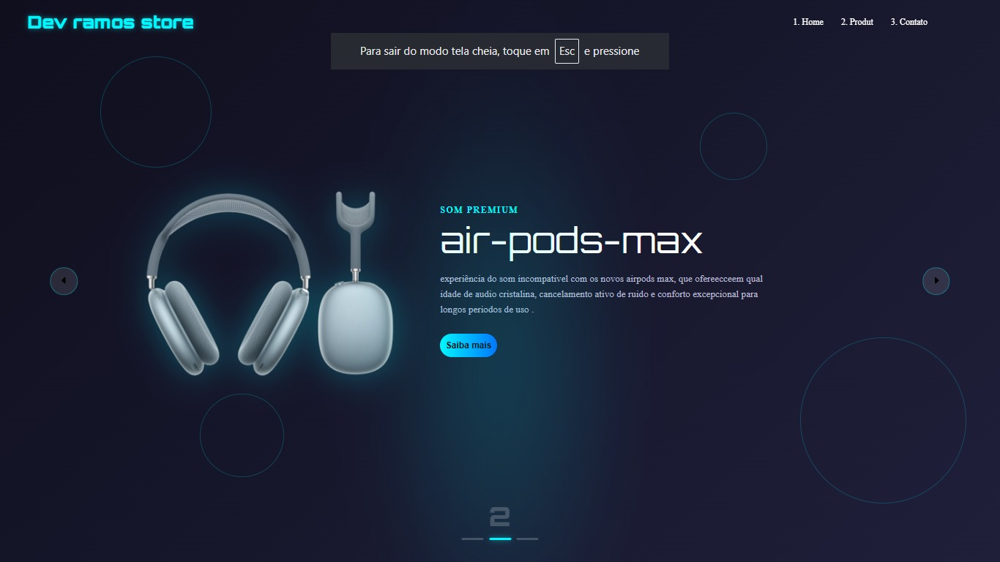
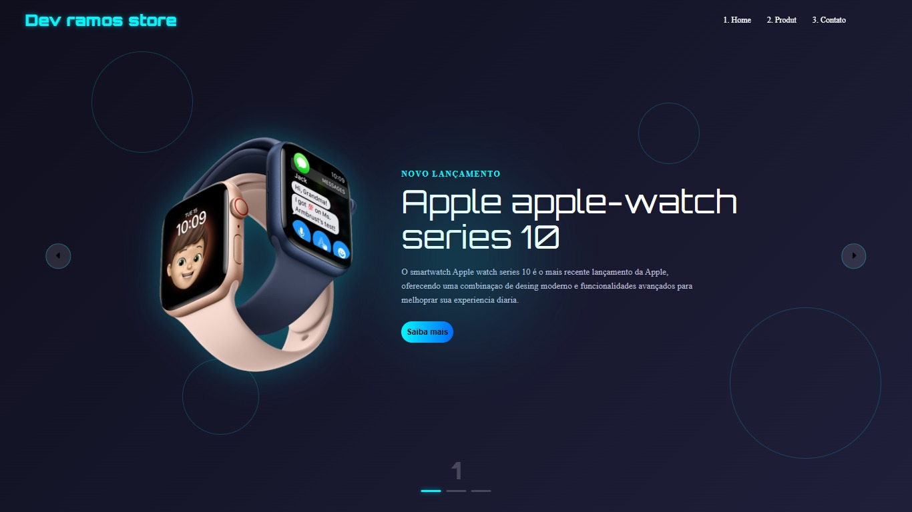
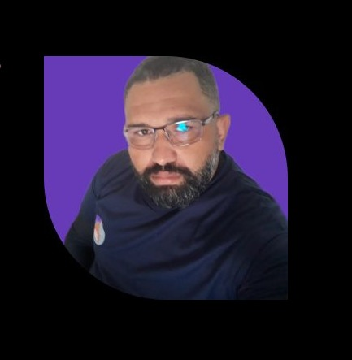

[READM.md](https://github.com/user-attachments/files/23273899/READM.md)
#  Projeto Dev ramos store

 Portifólio de vendas 
 ## Índice
- <a href = "#funcionalidades"> Funcionalidades do projeto</a> 
- <a href = "#Layout">Layout</a> 
- <a href = "#Demonstração">Demonstração</a> 
- <a href = "#Rodar">Como rodar o projeto</a> 
- <a href = "#Tecnologias utilizadas">Tecnologias Utilizadas</a> 
- <a href = "Autoras">Pessoas autoras</a> 
- <a href = "#Passos">Próximos passos</a> 

## funcionalidade do Projeto 

- [X] clicar nas setas do carrosel para mudar a imagem de produtos 

## Layout

## Demonstração
[Link demonstração](https://storied-squirrel-a5ee1d.netlify.app/)
## Como rodar este projeto

### Entrar na pasta do projeto
Loja de vendas

### Abrir o projeto no navegador (ou usar Live Server)
#### Se tiver a extensão Live Server do VS Code:
live-server

# Tecnologias Utilizadas 
| **HTML5** | Linguagem de marcação usada para estruturar o conteúdo das páginas web. | [🔗 Acessar](https://developer.mozilla.org/pt-BR/docs/Web/HTML) |
| **CSS3** | Linguagem de estilo para definir layout, cores, fontes e animações. | [🔗 Acessar](https://developer.mozilla.org/pt-BR/docs/Web/CSS) |
| **JavaScript (ES6)** | Linguagem de programação que adiciona interatividade e lógica ao site. | [🔗 Acessar](https://developer.mozilla.org/pt-BR/docs/Web/JavaScript) |
| **Google Fonts (Orbitron & Montserrat)** | Biblioteca de fontes modernas para design tecnológico e limpo. | [🔗 Acessar](https://fonts.google.com/) |
| **Bootstrap Icons (SVG)** | Biblioteca de ícones vetoriais usados para botões e navegação. | [🔗 Acessar](https://icons.getbootstrap.com/) |

# Pessoas Autoras

[Linkedin](https://www.linkedin.com/feed)

# Próximos passos

- [ ] vendas de produtos informados no site 
- [ ] acessos para vendas 
